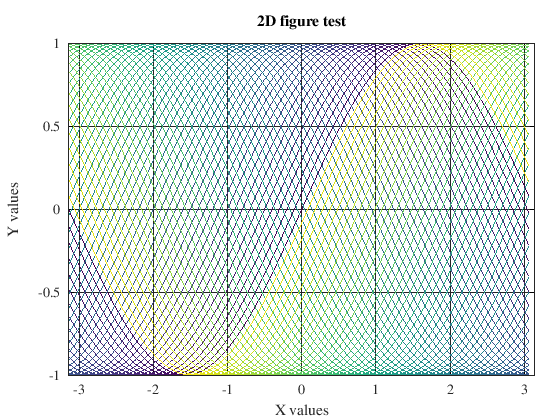
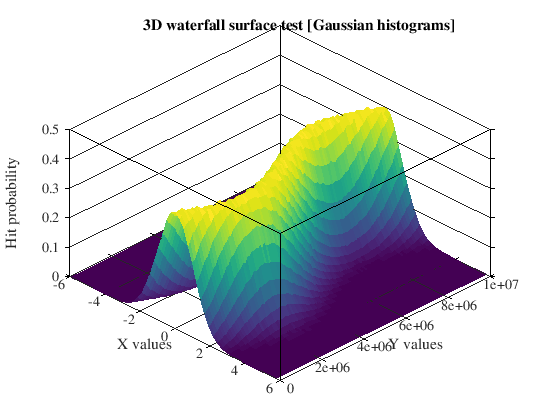

# Octave function wrappers for pretty plots
## Install
To install the package, you can simply copy it to easily accesible folder (e.g. `~/octave/nice` on Linux-based systems). To use the package in Octave code, you shoud write `addpath(<path/to/nice/folder/>)`, adding the files to the path of the Octave.

## Usage
To plot with this package, you will need to first create a figure with `nicefig()` function. You can pass multiple arguments to this function, font size/name, colormap to use for plots, size and position of the window.

## Examples

