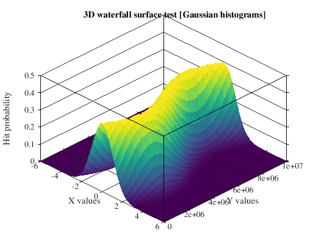

# Octave function wrappers for pretty plots
## Install
To install the package, you can use Octave command `pkg install 'https://gitty.jumpingcrab.com/Aleksei/nice/archive/master.tar.gz'`. This will install current master branch to your Octave packages. To install certain release, go to Releases page and copy link from the desired release.

## Usage
To plot with this package, you will need to first create a figure with `nicefig()` function. You can pass multiple arguments to this function, font size/name, colormap to use for plots, size and position of the window.

## Examples

